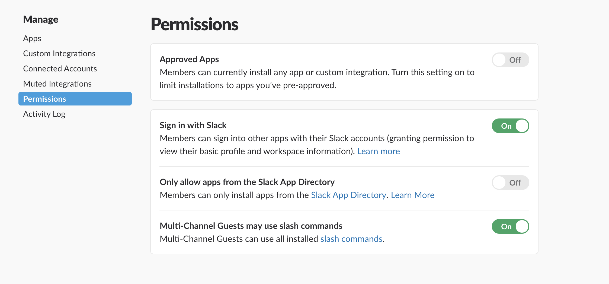
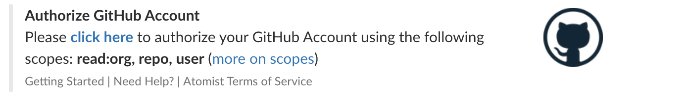
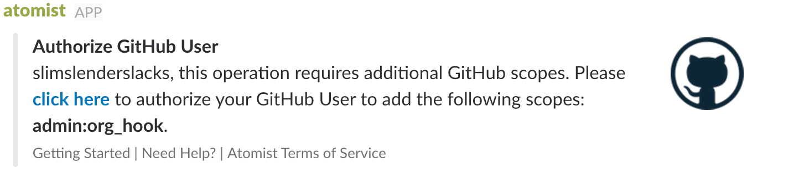
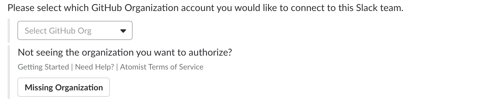
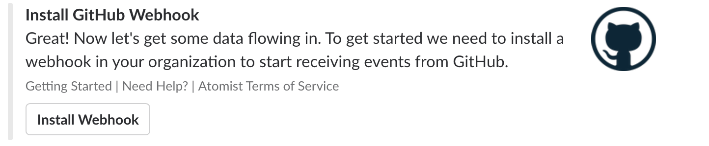
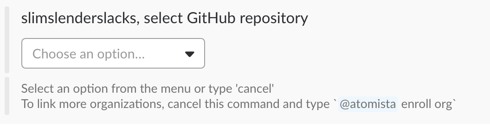

This is a step by step guide to setting up Atomist's built-in
automations to see and control your development flow
from [Slack][slack].

[slack]: https://slack.com/ (Slack)

## Slack

### Enroll Slack bot

Click the "Add to Slack" button below to invite the Atomist bot into
your Slack team.

<div style="text-align:center;">
  <a href="https://atm.st/2wiDlUe" onclick="trackOutboundLink('https://atm.st/2wiDlUe'); return false;" target="_blank">
    
  </a>
</div>

Slack's default configuration allows all team members to add new Slack applications.
However, your team's admins may decide to restrict the set of applications that can
can be added in your team.  The [permissions management page][manage-permissions] has
an "Approved Apps" setting to control this.

[manage-permissions]: https://slack.com/apps/manage/permissions



If your team requires approval for new apps and you're not a Slack
administrator, Slack helps you request approval from your Slack team's
administrators to install the Atomist application.

Currently the authorization process asks you to authorize two things:

1.  The Atomist app adds a bot user named "@atomist" to your team.
    Your team can `\invite` the Atomist bot to channels to access the
    full functionality of Atomist.  Bot users cannot create channels,
    cannot join channels unless they are invited by a non-bot channel
    member, and cannot see messages in channels where they are not a
    member.
2.  Atomist requests a scope called "Modify public channels".  This
    scope allows Atomist to help you setup channels.  For example,
    when you [create a project][create-project] in a new GitHub
    repository, Atomist can create a Slack channel to go with it.

!!! Note
    The Atomist app creates new channels on behalf of the user who
    first authorizes Atomist.

[create-project]: ../developer/create.md (Create Project with Atomist)

### Slack team ID

Some operations, like [connecting your CI with Atomist][ci], need you to pass
in your Slack team ID. To get your Slack team ID, send `team` to the Atomist
bot.

```
you> /invite @atomist
you> @atomist team
atomist> The Slack id for team your-slack-team is T1L0V3JTP
         16 of 24 users in this team have authorized themselves
```

[ci]: #continuous-integration (Connecting Atomist with Continuous Integration Platforms)

### Removing Atomist from Slack

You can remove the bot from all your channels instantly
by revoking access to the "Atomist" application.  We certainly hope it
doesn't come to this!

The [App Manage page][slack-app-settings] has a "Remove App" button at
the bottom of the page.  Please [let us know][support-email] if
there's anything we can do to clarify how the bot works within your
Slack team.

[slack-app-settings]: https://slack.com/apps/A0HM83NCC-atomist?page=1
[support-email]: mailto:support@atomist.com

## GitHub

Atomist helps you work with GitHub in two ways:

1.  By enabling webhooks, your automations can react to
    GitHub activities such as pushes, pull requests, or issues.
2.  Automations can expose commands that access GitHub through
    the v3 api, authorized by OAuth tokens.
    Each user on your team must independently authorize Atomist --
    this means that your users remain within the boundaries
    of the existing GitHub security model.  Atomist acts on _behalf_ of
    your users, not _instead_ of them.

### GitHub user authorization

When the Atomist bot first arrives in a team, it will send a direct
message to the authorizing user, requesting that they authorize
Atomist to access GitHub on their behalf.



This same dialog will be shown to users anytime Atomist detects that
an automation needs to access GitHub as that user.  Every user on the
team must individually opt in.  Atomist will display this option each
time an un-authorized user runs a command that requires a GitHub
authorization.  Users can ask for their current GitHub authorization
status by running:

```
you> @atomist github
```

Atomist will send a direct message to this user with their current
GitHub authorization status.

### Organization webhooks

GitHub organization members that have the [owner role][owners], are
allowed to configure organization webhooks.  This is convenient
because it only has to be configured once; however, you will require a
user who has the `Owner` role in your GitHub organization.

```
you> @atomist enroll org
```

When you choose to enroll a GitHub organization, you will most likely
be prompted to authorize a new scope (Atomist only asks for new scopes
when explicitly required).  The *admin:org_hook* is required when
enrolling a new GitHub organization.



If you are a member of more than one GitHub organization, Atomist will
ask you to choose which organization to enroll.



Finally, you will be presented with a button to configure the organization webhook.



[owners]: https://help.github.com/articles/permission-levels-for-an-organization/

### Repository webhooks

If your team does not use a GitHub organization account, you can
choose to configure webhooks on individual repositories owned by your
user account.

```
you> @atomist install webhook
```

The bot now asks for the `owner` of the repository.  This question is
skipped if there is only one valid choice (your user account).  Next the bot
asks you to select the repository to receive the new webhook.

<div style="text-align:center;">
  
</div>

## Linking Slack & GitHub

Now that you have Slack and GitHub connected with Atomist, you should
"link" GitHub repositories with Slack channels so you can see and
control your project's activity from Slack.  All you need to do is
invite the Atomist bot to a Slack channel and then send it `repo`.

```
/invite @atomist
@atomist repo
```

The bot will open a thread and ask you what GitHub repository you want
to link to the channel.  If you added an organization webhook, you can
link any repository in your GitHub organization.  If you added
webhooks to individual repositories, you will only be able to link
those repositories.

## Continuous integration

Atomist natively supports several continuous integration
(CI) platforms, listening for CI events, correlating them with the
commits that triggered the build, and showing contextualized
notifications in a Slack channel linked to the repository.  To enable
this capability, just add the desired Atomist CI
webhook URL to your CI configuration.

!!! note
    In the examples below, replace `TEAM_ID` with your Slack team ID.

### CircleCI

To send events from [CircleCI][circleci] to Atomist, add the following
snippet to your `.circleci/config.yml` configuration file.

```yaml
notify:
  webhooks:
    - url: https://webhook.atomist.com/atomist/circle/teams/TEAM_ID
```

[circleci]: https://circleci.com/ (CircleCI)

### Jenkins

You can send events from [Jenkins][jenkins] to Atomist using
the [notification plugin][not-plugin], configuring it to send its
payload to
`https://webhook.atomist.com/atomist/jenkins/teams/TEAM_ID`.

If you configure your build using a [`Jenkinsfile`][jenkinsfile], add
these functions to your `Jenkinsfile`.  Don't forget to replace
`TEAM_ID` with your Slack team ID.

```groovy
import groovy.json.JsonOutput

def getSCMInformation() {
    def gitUrl = sh(returnStdout: true, script: 'git config --get remote.origin.url').trim()
    def gitSha = sh(returnStdout: true, script: 'git rev-parse HEAD').trim()
    def gitBranch = sh(returnStdout: true, script: 'git name-rev --always --name-only HEAD').trim().replace('remotes/origin/', '')
    return [ url: gitUrl, branch: gitBranch, commit: gitSha ]
}

def notifyAtomist(buildStatus, buildPhase="FINALIZED",
                  endpoint="https://webhook.atomist.com/atomist/jenkins/teams/TEAM_ID") {

    def payload = JsonOutput.toJson([
        name: env.JOB_NAME,
        duration: currentBuild.duration,
        build: [
            number: env.BUILD_NUMBER,
            phase: buildPhase,
            status: buildStatus,
            full_url: env.BUILD_URL,
            scm: getSCMInformation()
        ]
    ])
    sh "curl --silent -XPOST -H 'Content-Type: application/json' -d '${payload}' ${endpoint}"
}
```

Then call `notifyAtomist` when the build starts (in the first
stage) and ends (in the `post` block), sending the appropriate
status and phase.

-   Start: `notifyAtomist("STARTED", "STARTED")`
-   Succesful: `notifyAtomist("SUCCESS")`
-   Unstable: `notifyAtomist("UNSTABLE")`
-   Failure: `notifyAtomist("FAILURE")`

[jenkins]: https://jenkins.io/ (Jenkins)
[not-plugin]: https://wiki.jenkins-ci.org/display/JENKINS/Notification+Plugin (Jenkins Notification Plugin)
[jenkinsfile]: https://jenkins.io/doc/book/pipeline/jenkinsfile/ (Jenkinsfile)

### Travis CI

To send events from [Travis CI][travisci] to Atomist, add the
following snippet to your `.travis.yml` configuration file.

```yaml
notifications:
  webhooks:
    urls:
      - https://webhook.atomist.com/atomist/travis/teams/TEAM_ID
    on_success: always
    on_failure: always
    on_start: always
    on_cancel: always
    on_error: always
```

[travisci]: https://travis-ci.org (Travis CI)

